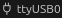
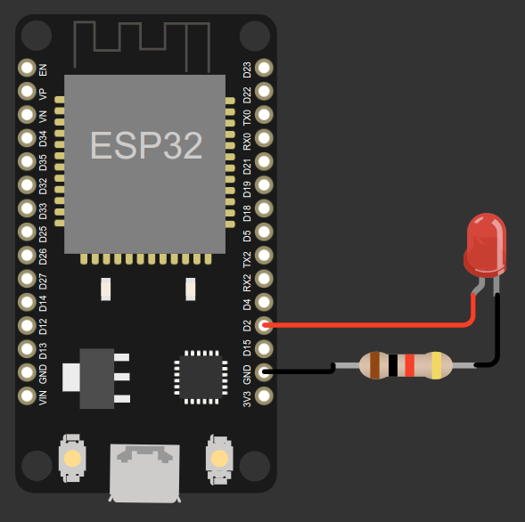

<<<<<<< HEAD
<h1 align="center">GPIO Control Interface for Esp-idf</h1>

<div align="center">
  <span>
    <a href="https://github.com/Dhuky/GPIO-Control/issues/new?assignees=&labels=bug&template=bug_report.md&title=bug%3A+">Report a Bug</a> ·
    <a href="https://github.com/Dhuky/GPIO-Control/issues/new?assignees=&labels=enhancement&template=feature_request.md&title=feat%3A+">Request a Feature</a> ·
    <a href="https://github.com/Dhuky/GPIO-Control/discussions">Ask a Question</a>
  </span>
</div>

---

<div align="center">
  <span>
    <a href="https://choosealicense.com/licenses/mit/">
      
    </a>
    <a href="#">
      
    </a>
    <a href="#">
      
    </a>
    <a href="#">
      
    </a>
  </span>
</div>

## About the Project

**GPIO Control** is a component developed for the ESP-IDF framework that simplifies GPIO control on ESP32 devices. This project provides an intuitive interface to easily configure and control GPIO pins, saving time and effort in embedded projects.

### Main Features:
- Simplified GPIO pin configuration
- Clear abstraction interface for easy usage

## Tools and Technologies Used

During the development of **GPIO Control**, the following tools and technologies were used:

### Hardware
- **ESP Model**: ESP32 DevKit V1
- **Architecture**: Dual-Core Xtensa LX6
- **Flash Memory**: 4 MB (standard for most DevKit V1 models)
- **Available GPIO Pins**: 34 GPIO pins (with multiple functions including PWM, ADC, and DAC)
- **Supported Interfaces**: UART, SPI, I2C, CAN, Ethernet, and others
- **Operating Voltage**: 3.3V
- **Micro-USB Connector**: For power and code upload

### Frameworks and SDK
- **PlatformIO**: Version 6.8.1 (espressif32)
- **ESP-IDF**: Version 5.3.1

### Development Environment
- **Visual Studio Code**:
  - Recommended Extensions:
    - [PlatformIO IDE](https://marketplace.visualstudio.com/items?itemName=platformio.platformio-ide): Main tool used in the project for managing and compiling ESP32 projects.
    - [Espressif IDF Extension](https://marketplace.visualstudio.com/items?itemName=espressif.esp-idf-extension): Alternative to PlatformIO, offering full official integration with ESP-IDF, ideal for those who prefer working directly with Espressif's SDK.
    - [C/C++ Extension Pack](https://marketplace.visualstudio.com/items?itemName=ms-vscode.cpptools-extension-pack): For advanced C++ support.

## Getting Started

### Requisites
Before starting, make sure you have the following:
- **ESP-IDF** installed (minimum version: 4.x)
- An **ESP32** microcontroller

### Installation and setup
1. Clone the repository:
   ```sh
   git clone https://github.com/Dhuky/GPIO-Control.git
   ```
2. Navigate to the project directory and compile it using the command `pio run`, or if your development environment is properly configured, `idf.py build`. Using PlatformIO and VSCode, it's graphically easy to do the same without terminal commands, just click the checkmark icon `🗸` on the IDE's bottom bar.
3. Wait for success to be generated at the terminal and the project is ready to be loaded on your microcontroller
4. Use the `pio run --target upload` command automatically to ESP32. Make sure the plate is connected via USB and that the correct serial port is configured, Or with at Esp-Didf Terminal `idf-py flash`. With Platformio and VSCode it is easy to click on the icon `->` with the proper serial port of the connected device '' ttyusb0 in my case that I use the Linux system, if the system is windows will be described with `COM` port

## Circuit Assembly

### Schematic Diagram
Here is a basic schematic diagram for assembly using the **ESP32 DevKit V1**:

<div align="center">
  
</div>


### Required Components:
- 1 x **ESP32** board
- 1 x LED of your preferred color (In this example, an external LED is used, but ESP32 boards like the DevKit V1 have an onboard LED that can be used)
- 1 x 1kΩ resistor (lower values like 330Ω are also sufficient)
- Jumper wires

### Step-by-step assembly:
1. Connect the **anode (positive pin)** of the LED to pin **D2** of the ESP32 through the 1kΩ resistor.
2. Connect the **cathode (negative pin)** of the LED to **GND** on the ESP32.
3. Make sure all connections are secure before powering the circuit.

---

## Contributing

First off, thank you for considering contributing to GPIO Control! Whether it's reporting bugs, suggesting features, or improving documentation, your contributions are always appreciated.
When reporting bugs or suggesting enhancements, please ensure they are:
- **Reproducible**: Provide clear steps to reproduce the issue.
- **Specific**: Include details like the version, environment, and logs if available.
- **Unique**: Check if similar issues are already opened before submitting a new one.
- **Scoped**: Focus on one issue or feature per 


---

### Support

Need help? Reach out to the maintainer via:
- **GitHub Discussions**: [Join the conversation](https://github.com/Dhuky/GPIO-Control/discussions)
- **Email**: Available in the GitHub profile of the maintainer

---

### License

This project is licensed under the **MIT license**, giving you the freedom to use, modify, and distribute the software while respecting the conditions of the license.  
See the [LICENSE](https://github.com/Dhuky/GPIO-Control/blob/main/LICENSE) file for more information.

---

### Acknowledgements

Special thanks to the following resources and tools that inspired or contributed to this project:
- [ESP-IDF Documentation](https://docs.espressif.com/projects/esp-idf/en/latest/)
- [PlatformIO IDE](https://platformio.org/)
- [How to Write a Great README](https://thoughtbot.com/blog/how-to-write-a-great-readme)
- [Make a README](https://www.makeareadme.com/)
- [Best README Template](https://github.com/othneildrew/Best-README-Template)
- [Badges and Shields](https://github.com/badges/shields)
- Various contributors and tutorials from the GitHub community
=======
# GPIO-Control
Readme in the construction phase
>>>>>>> a1df174f0331c141df7a96058de696d559ab3766
